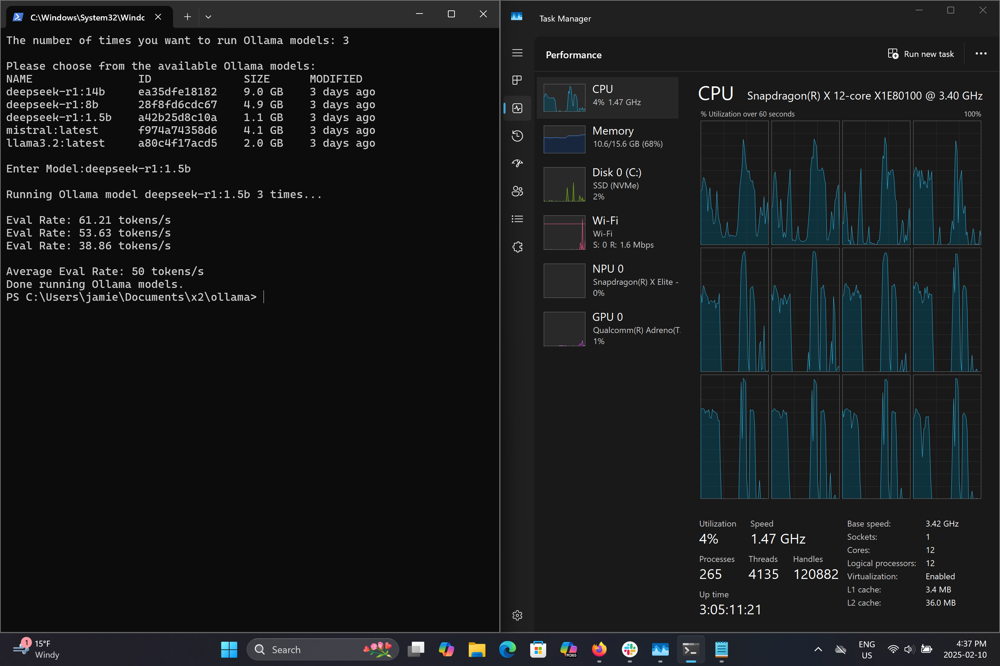

This tool is intended to help automate testing generative text models on
Ollama.

Users specify the number of times they would like to run ollama with a
standardized prompt.

The script then runs ollama N times and provides an average eval rate in
Tokens/Second.

Note: Batch scripts operate on Integers, so some precision is lost. i

# Usage

``` bash.num
C:\>Path\To\Tool>ollamaBench.bat
```

# Run Time Sample

<figure>

</figure>
